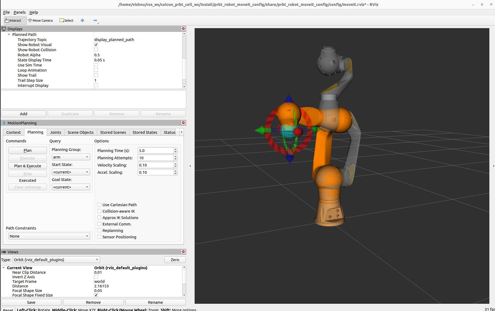

Pilz manipulator PRBT 6
=======================

This guide provides instructions on how to set up Pilz manipulators PRBT 6 using ros2_canopen.
Before following this guide, make sure to refer to the user guide to :doc:`../user-guide/configuration`,
:doc:`../user-guide/how-to-create-a-configuration` and :doc:`../user-guide/how-to-create-a-robot-system`.
Additionally, this guide is based on: `pilz_robots <https://github.com/PilzDE/pilz_robots>`_.

To configure the PRBT 6 using ros2_canopen, please refer to the pre-existing configuration in the `pilz_robot <https://github.com/ipa-cmh/prbt_robot.git>`_ package.

Package creation and setup
----------------------------
- Create a new configuration package for the robot with the name ``prbt_robot_support``.

    .. code-block:: console

        $ ros2 pkg create --dependencies ros2_canopen lely_core_libraries --build-type ament_cmake prbt_robot_support
        $ cd prbt_robot_support
        $ rm -rf src
        $ rm -rf include
        $ mkdir -p launch
        $ mkdir -p config
        $ mkdir -p urdf
        $ touch config/prbt_ros2_control.yaml

- Create a new bus configuration folder with name ``prbt``. And create ``bus.yml`` and copy ``prbt_0_1.dcf`` from `pilz_support <https://github.com/PilzDE/pilz_robots/tree/noetic-devel/prbt_support/config>`_ package.

    Now the package structure should look like this:

    ::

        prbt_robot_support
            ├── config
            │   ├── prbt
            │   |   ├── bus.yml
            │   |   └── prbt_0_1.dcf
            │   └── prbt_ros2_control.yaml
            ├── launch
            ├── urdf
            ├── CMakeLists.txt
            └── package.xml

- Add the following to the ``bus.yml``

    .. code-block:: yaml

        options:
            dcf_path: "@BUS_CONFIG_PATH@"
            master:
                node_id: 1
                driver: "ros2_canopen::MasterDriver"
                package: "canopen_master_driver"
                sync_period: 10000

            defaults:
                dcf: "prbt_0_1.dcf"
                driver: "ros2_canopen::Cia402Driver"
                package: "canopen_402_driver"
                period: 10
                heartbeat_producer: 1000
                switching_state: 2
                position_mode: 7
                scale_pos_from_dev: 0.00001745329252
                scale_pos_to_dev: 57295.7795131
                sdo:
                    - {index: 0x6081, sub_index: 0, value: 1000}
                    - {index: 0x60C2, sub_index: 1, value: 10} # Interpolation time period at 10 ms matches the period.

                tpdo: # TPDO needed statusword, actual velocity, actual position, mode of operation
                    1:
                    enabled: true
                    cob_id: "auto"
                    transmission: 0x01
                    mapping:
                        - {index: 0x6041, sub_index: 0} # status word
                        - {index: 0x6061, sub_index: 0} # mode of operation display
                    2:
                    enabled: true
                    cob_id: "auto"
                    transmission: 0x01
                    mapping:
                        - {index: 0x6064, sub_index: 0} # position actual value
                        - {index: 0x606c, sub_index: 0} # velocity actual position
                    3:
                    enabled: false
                    4:
                    enabled: false
                rpdo: # RPDO needed controlword, target position, target velocity, mode of operation
                    1:
                    enabled: true
                    cob_id: "auto"
                    mapping:
                    - {index: 0x6040, sub_index: 0} # controlword
                    - {index: 0x6060, sub_index: 0} # mode of operation
                    - {index: 0x60C1, sub_index: 1} # interpolated position data
                    2:
                    enabled: true
                    cob_id: "auto"
                    mapping:
                    - {index: 0x607A, sub_index: 0} # target position

            nodes:
                prbt_joint_1:
                    node_id: 3
                prbt_joint_2:
                    node_id: 4
                prbt_joint_3:
                    node_id: 5
                prbt_joint_4:
                    node_id: 6
                prbt_joint_5:
                    node_id: 7
                prbt_joint_6:
                    node_id: 8

- Create ``prbt.ros2_control.xacro`` file in ``urdf`` folder and add the following to the file:

    .. code-block:: xml

        <?xml version="1.0"?>
        <robot xmlns:xacro="http://www.ros.org/wiki/xacro">

            <xacro:macro name="prbt_ros2_control" params="
                name
                prefix
                bus_config
                master_config
                can_interface_name
                master_bin">

                <ros2_control name="${name}" type="system">
                    <hardware>
                        <plugin>canopen_ros2_control/RobotSystem</plugin>
                        <param name="bus_config">${bus_config}</param>
                        <param name="master_config">${master_config}</param>
                        <param name="can_interface_name">${can_interface_name}</param>
                        <param name="master_bin">"${master_bin}"</param>
                    </hardware>
                    <joint name="${prefix}joint_1">
                        <param name="device_name">prbt_joint_1</param>
                    </joint>
                    <joint name="${prefix}joint_2">
                        <param name="device_name">prbt_joint_2</param>
                    </joint>
                    <joint name="${prefix}joint_3">
                        <param name="device_name">prbt_joint_3</param>
                    </joint>
                    <joint name="${prefix}joint_4">
                        <param name="device_name">prbt_joint_4</param>
                    </joint>
                    <joint name="${prefix}joint_5">
                        <param name="device_name">prbt_joint_5</param>
                    </joint>
                    <joint name="${prefix}joint_6">
                        <param name="device_name">prbt_joint_6</param>
                    </joint>
                </ros2_control>

            </xacro:macro>

        </robot>

- Add the following to the ``prbt_ros2_control.yaml`` file:

    .. code-block:: yaml

        controller_manager:
            ros__parameters:
                update_rate: 100  # Hz

                joint_state_broadcaster:
                type: joint_state_broadcaster/JointStateBroadcaster

                arm_controller:
                type: joint_trajectory_controller/JointTrajectoryController

        arm_controller:
            ros__parameters:
                joints:
                    - prbt_joint_1
                    - prbt_joint_2
                    - prbt_joint_3
                    - prbt_joint_4
                    - prbt_joint_5
                    - prbt_joint_6
                command_interfaces:
                    - position
                state_interfaces:
                    - position
                    - velocity
                stop_trajectory_duration: 0.2
                state_publish_rate:  100.0
                action_monitor_rate: 25.0
                goal_time: 0.0
                limits:
                    prbt_joint_1:
                        has_acceleration_limits: true
                        max_acceleration: 6.0
                    prbt_joint_2:
                        has_acceleration_limits: true
                        max_acceleration: 6.0
                    prbt_joint_3:
                        has_acceleration_limits: true
                        max_acceleration: 6.0
                    prbt_joint_4:
                        has_acceleration_limits: true
                        max_acceleration: 6.0
                    prbt_joint_5:
                        has_acceleration_limits: true
                        max_acceleration: 6.0
                    prbt_joint_6:
                        has_acceleration_limits: true
                        max_acceleration: 6.0

- Create a launch file with name ``robot.launch.py`` in the launch directory of your package. Follow the instructions :doc:`../user-guide/how-to-create-a-robot-system`  to complete the launch file. The launch file should look like this:

    .. code-block:: python

        import os
        from ament_index_python import get_package_share_directory
        from launch import LaunchDescription
        from launch.actions import DeclareLaunchArgument
        from launch.substitutions import Command, FindExecutable, LaunchConfiguration, PathJoinSubstitution
        from launch_ros.actions import Node
        from launch_ros.substitutions import FindPackageShare
        from launch.actions import IncludeLaunchDescription
        from launch.launch_description_sources import PythonLaunchDescriptionSource

        from launch.actions import IncludeLaunchDescription
        from launch.launch_description_sources import PythonLaunchDescriptionSource
        import launch_ros

        def generate_launch_description():
            declared_arguments = []

            declared_arguments.append(
                DeclareLaunchArgument(
                    "description_package",
                    description="Package where urdf file is stored.",
                    default_value="prbt_robot_support"
                )
            )
            declared_arguments.append(
                DeclareLaunchArgument(
                    "can_interface_name",
                    default_value="vcan0",
                    description="Interface name for can",
                )
            )
            declared_arguments.append(
                DeclareLaunchArgument(
                    "use_ros2_control",
                    default_value="true",
                    description="Use ros2_control",
                )
            )

            controller_config = PathJoinSubstitution([FindPackageShare("prbt_robot_support"), "config", "prbt_ros2_control.yaml"])
            bus_config = PathJoinSubstitution([FindPackageShare("prbt_robot_support"), "config", "prbt", "bus.yml"])
            master_config = PathJoinSubstitution([FindPackageShare("prbt_robot_support"), "config", "prbt", "master.dcf"])
            can_interface_name = LaunchConfiguration("can_interface_name")

            master_bin_path = os.path.join(
                        get_package_share_directory("prbt_robot_support"),
                        "config",
                        "prbt",
                        "master.bin",
                    )
            if not os.path.exists(master_bin_path):
                master_bin_path = ""
            robot_description_content = Command(
                [
                    PathJoinSubstitution([FindExecutable(name="xacro")]),
                    " ",
                    PathJoinSubstitution([FindPackageShare(LaunchConfiguration("description_package")), "urdf", "prbt.xacro"]),
                    " ",
                    "bus_config:=",
                    bus_config,
                    " ",
                    "master_config:=",
                    master_config,
                    " ",
                    "master_bin:=",
                    master_bin_path,
                    " ",
                    "can_interface_name:=",
                    can_interface_name,
                ]
            )
            robot_description = {"robot_description": launch_ros.descriptions.ParameterValue(robot_description_content, value_type=str)}

            robot_state_publisher_node = Node(
                package="robot_state_publisher",
                executable="robot_state_publisher",
                output="both",
                parameters=[robot_description],
            )

            # Controller manager
            controller_manager_node = Node(
                package="controller_manager",
                executable="ros2_control_node",
                output="both",
                parameters=[robot_description, controller_config],
            )

            joint_state_broadcaster_spawner = Node(
                package="controller_manager",
                executable="spawner",
                arguments=["joint_state_broadcaster", "--controller-manager", "/controller_manager"],
            )
            arm_controller_spawner = Node(
                package="controller_manager",
                executable="spawner",
                arguments=["arm_controller", "--controller-manager", "/controller_manager"],
            )

            nodes_list = [
                robot_state_publisher_node,
                controller_manager_node,
                joint_state_broadcaster_spawner,
                arm_controller_spawner,
            ]

            return LaunchDescription(declared_arguments + nodes_list)

- Edit the CMakeLists.txt file of your package and add the following lines after the find_package section.

    .. code-block:: cmake

        cogen_dcf(prbt)

        install(DIRECTORY
        launch urdf meshes
        DESTINATION share/${PROJECT_NAME})

        install(FILES config/prbt_ros2_control.yaml
        DESTINATION share/${PROJECT_NAME}/config)

- Build your package and source the setup file.

MoveIt2 setup
-------------

Follow the `MoveIt Setup Assistance <https://moveit.picknik.ai/main/doc/examples/setup_assistant/setup_assistant_tutorial.html?highlight=setup%20assistance>`_ tutorial
and create the MoveIt2 package for your robot. The MoveIt2 package should be created in the same workspace as your robot package.

- Update ``moveit_controller.yaml`` file in the config directory of your MoveIt2 package. The file should look like this:

    .. code-block:: yaml

        # MoveIt uses this configuration for controller management
        trajectory_execution:
        allowed_execution_duration_scaling: 1.2
        allowed_goal_duration_margin: 0.5
        allowed_start_tolerance: 0.01

        moveit_controller_manager: moveit_simple_controller_manager/MoveItSimpleControllerManager

        moveit_simple_controller_manager:
        controller_names:
            - arm_controller

        arm_controller:
            type: FollowJointTrajectory
            action_ns: follow_joint_trajectory
            default: True
            joints:
            - prbt_joint_1
            - prbt_joint_2
            - prbt_joint_3
            - prbt_joint_4
            - prbt_joint_5
            - prbt_joint_6

- Create a launch file ``moveit_planning_execution.launch.py`` to launch moveit and robot components.

    .. code-block:: python

        from launch import LaunchDescription
        from launch.actions import DeclareLaunchArgument, IncludeLaunchDescription
        from launch.substitutions import LaunchConfiguration, PathJoinSubstitution
        from launch_ros.substitutions import FindPackageShare
        from launch.actions import IncludeLaunchDescription
        from launch.launch_description_sources import PythonLaunchDescriptionSource

        from launch.actions import TimerAction

        from moveit_configs_utils import MoveItConfigsBuilder

        def generate_launch_description():
            moveit_config = MoveItConfigsBuilder(
                "prbt", package_name="prbt_robot_moveit_config"
            ).to_moveit_configs()
            declared_arguments = []

            declared_arguments.append(
                DeclareLaunchArgument(
                    "can_interface_name",
                    default_value="can0",
                    description="Interface name for can",
                )
            )

            robot_hw_node = IncludeLaunchDescription(
                PythonLaunchDescriptionSource(
                    [PathJoinSubstitution([FindPackageShare("prbt_robot_support"), "launch", "robot.launch.py"])],
                ),
                launch_arguments={
                    "can_interface_name": LaunchConfiguration("can_interface_name"),
                }.items(),
            )

            virtual_joints = IncludeLaunchDescription(
                PythonLaunchDescriptionSource(
                    str(
                        moveit_config.package_path / "launch/static_virtual_joint_tfs.launch.py"
                    )
                ),
            )

            move_group = IncludeLaunchDescription(
                PythonLaunchDescriptionSource(
                    str(moveit_config.package_path / "launch/move_group.launch.py")
                ),
            )

            rviz = IncludeLaunchDescription(
                PythonLaunchDescriptionSource(
                    str(moveit_config.package_path / "launch/moveit_rviz.launch.py")
                ),
            )

            node_list = [
                robot_hw_node,
                virtual_joints,
                move_group,
                rviz,
            ]

            return LaunchDescription(declared_arguments + node_list)

Running the PRBT robot
------------------------
There are two ways to run the demo. First you can use ``canopen_fake_slave`` to simulate the robot using CAN interface ``vcan0``. Second you can use the real robot.
Refer :doc:`../quickstart/operation` to configure CAN interface.

.. code-block:: bash

    # Run the demo using fake robot
    ros2 launch prbt_robot_moveit_config moveit_planning_execution.launch.py can_interface_name:=vcan0

    # Run the demo using real robot
    ros2 launch prbt_robot_moveit_config moveit_planning_execution.launch.py can_interface_name:=can0

Rviz2:

