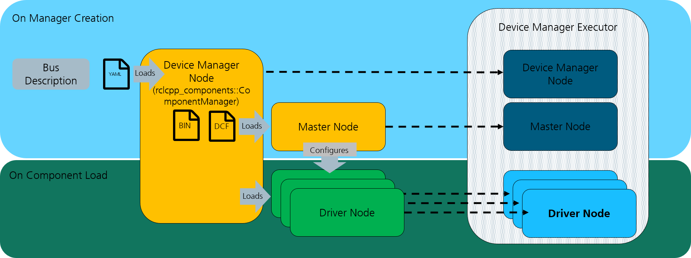

Managed Service Interface
=========================

Device Container with Managed Nodes
-----------------------------------
The device container operates as a ROS2 component manager with load and unload services disabled. It utilizes the Bus Configuration File (``bus.yml``) to
load devices. This container also offers a list service, which can be utilized with ros2cli to verify the loaded components.

    Overview of the device manager concept.

Upon startup, the device container uses the bus description file to identify and load the appropriate drivers for each device,
including the CANopen master node. Initially, the nodes are in an unconfigured state.

The default launch files from the ``canopen_core`` package automatically initiate the lifecycle manager node, which orchestrates
the sequencing and state transitions of all nodes within the container. Activating the lifecycle manager progresses all nodes from an
unconfigured to an active state in a predetermined sequence.

.. note::

    For custom implementations, it is crucial to configure and activate the master node before setting up any driver nodes to ensure proper system functionality.

Bus Configuration
-----------------
The bus configuration specific to this interface must incorporate driver classes designated as lifecycle drivers. The master driver within
this setup dictates whether the ``bus.yml`` is considered a managed or an unmanaged service interface.

.. csv-table:: Available Driver Components
   :header: "Package", "Component"

   canopen_master_driver, ros2_canopen::LifecycleMasterDriver
   canopen_proxy_driver, ros2_canopen::LifecycleProxyDriver
   canopen_402_driver, ros2_canopen::LifecycleCia402Driver

Launching Parameters
--------------------
The device manager's operation is guided by several crucial configuration parameters:

.. csv-table:: Configuration Parameters
   :header: "Parameter", "Type", "Description"

   bus_conf, string, (Mandatory) Path to the bus configuration YAML-file
   master_dcf, string, (Mandatory) Path to the DCF file for the master node, typically generated by dcfgen as master.dcf.
   master_bin, string, (Optional) Path to the concise DCF (.bin) file for master configuration, typically generated by dcfgen as master.bin. (default: "")
   can_interface_name, string, (Mandatory) Name of the CAN interface to be used. (default: "vcan0")

This section outlines the configuration and management of nodes within the ROS2 CANopen architecture, emphasizing the importance of lifecycle management
for robust device interaction and control.
